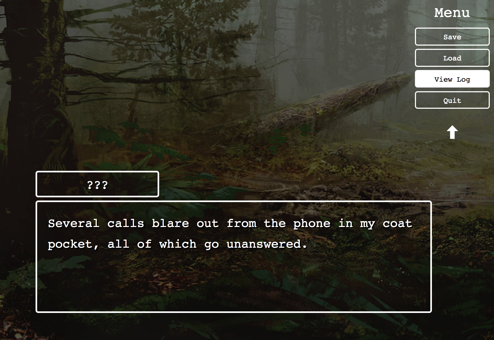

# Three Kings: A Visual Novel

**Live Demo: http://three-kings.herokuapp.com/**

**Description**: *Three Kings* is a short interactive story loosely based off the popular Reddit post by the same name. The choices made throughout the second half of the game will affect the story. The total gameplay length is about 10 to 20 minutes. The player can discover a total of 4 different endings.

#### This app has the following features:

* A menu that you can collapse and expand
* The ability to save and load your game progress
* A log to read previous lines of text that you might have missed
* Checkpoints at crucial parts of the story

This visual novel was created using the React and Redux libraries.
